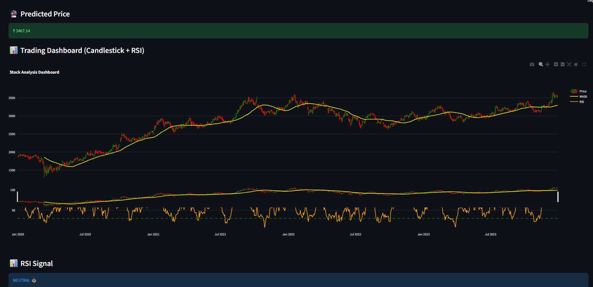

# 📊 Smart Stock Analysis Dashboard 🚀


An interactive stock market analysis web application built using **Python, Streamlit, and Machine Learning**.  
This dashboard provides real-time stock insights, advanced visualizations, and predictive analytics.

---

## 🚀 Live Demo
👉 https://stock-dashboard-ekhqta37gduu93trts5yek.streamlit.app/

---

## 📌 Features

- 📈 Real-time stock data using yfinance  
- 🤖 Machine Learning-based price prediction (Random Forest)  
- 📊 TradingView-style dashboard (Candlestick + RSI)  
- 🕯️ Candlestick chart visualization  
- 📉 RSI (Relative Strength Index) indicator  
- 📈 Moving Average (MA50)  
- 📅 Custom date range selection  
- 🔔 Buy/Sell signal generation  

---

## 🛠️ Tech Stack

**Programming:** Python  
**Libraries:** Pandas, NumPy, Scikit-learn, Plotly  
**Framework:** Streamlit  
**Data Source:** yfinance  

---

## 📸 Preview



---

## ⚙️ Installation & Setup

### 1️⃣ Clone the repository
```bash
git clone https://github.com/devbratpandey7866-png/stock-dashboard.git
cd stock-dashboard